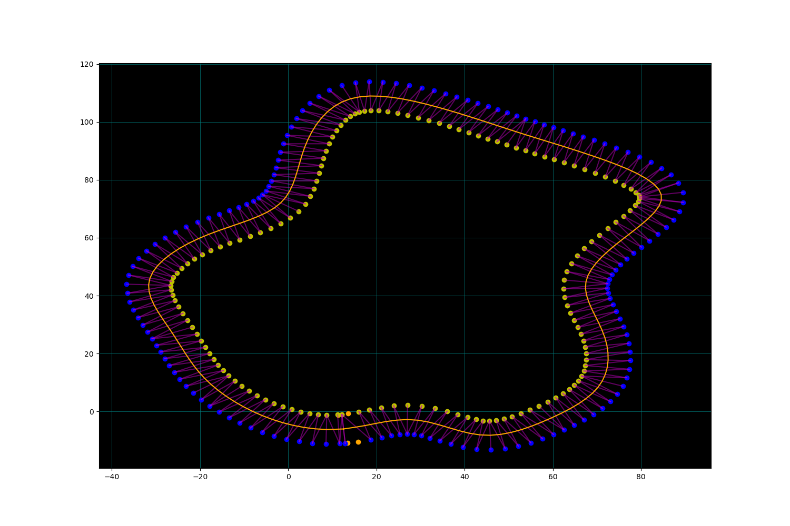
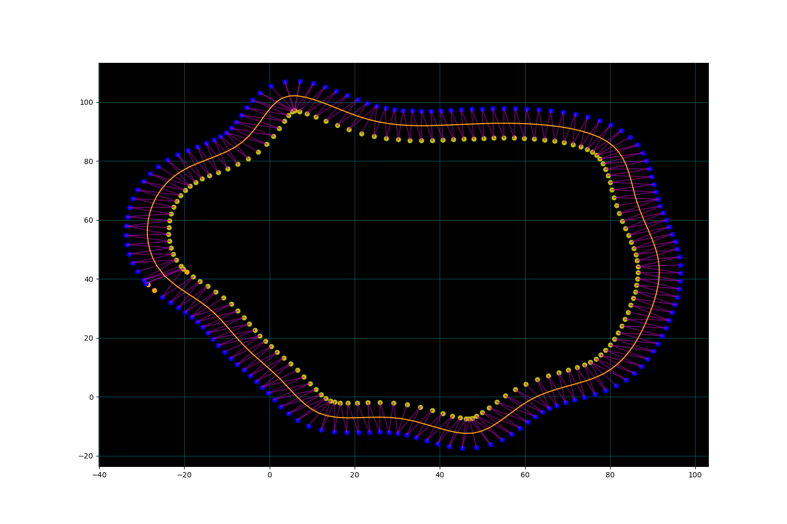
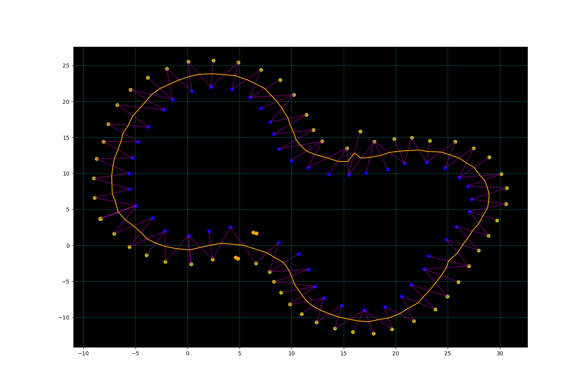

# Middle of tracking racing line

This project was initally made as a proof of concept from something I was working on with the University of Glasgow driverless team. This will sort the cones cones that are in the .csv files. It will then iterate through them and generate a pair of yellow and blue cones based on their proximity. From this it will produce a mid point between those two cones.

## Running script

This will iterate through the tracks folder and run the script on everything that is in there. If you would like to add a track then as long as it is following the same format then it should work. 

The actual script will take the cones from the file and order them from cloest out. From these it will then generate a middle line by setting pairs of cones using a proximity selection and then generating a middle point between this pair. You could then apply a simple spline function to the middle line to 'smooth' out the path (NOTE: The implementation of the spline has some issues so doesnt produce the best line but that will be worked on soon).

To run the script use the following commands:

`python3 main.py`

This will run the file with the settings of:
    - Not saving graphs
    - Not showing pairs
    - Showing graph

To change this you can use the following:

`--pairs` or `-p` to show pairs

`--display` or `-d` to not show the graphs

`--save` or `-s` to save the graphs

`--spline` or `-n` to apply a spline to middle line

## Images

Below are images of the tracks that I included in the github with the middle line generated.

