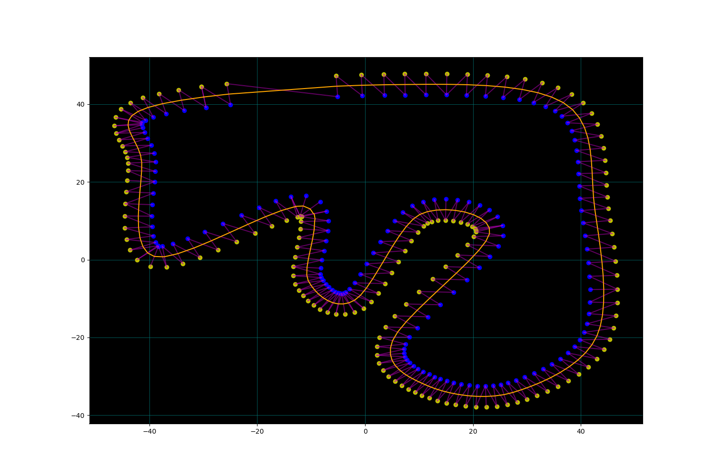

# Middle of tracking racing line

This project was initally made as a proof of concept from something I was working on with the University of Glasgow driverless team. This will sort the cones cones that are in the .csv files. It will then iterate through them and generate a pair of yellow and blue cones based on their proximity. From this it will produce a mid point between those two cones.

## Running script

If you would like to save the plots then you will need to go to the bottom of the main function and uncomment out the plt.savefig line. Apart from that the script will run and iterate through the files in the tracks folder so if you would like it add a track it should work as long as the provided track is using the same format. When iterating through the script will dispaly the graph with the calculated middline and will display the pairs of cones.

To run the script use the following command:

`python3 main.py`

## Images

Below are images of the tracks that I included in the github with the middle line generated.

